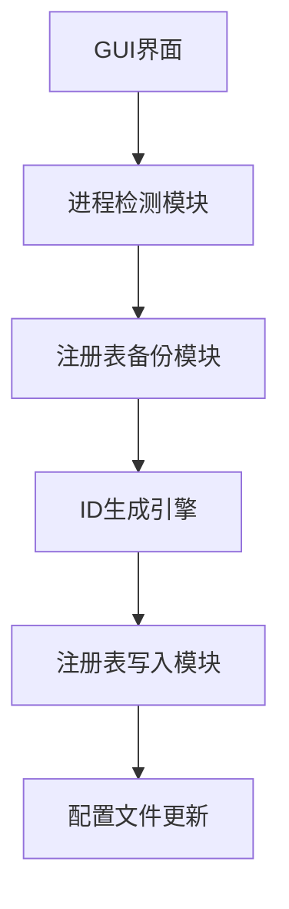

## Cursor ID 重置工具开源声明
## ⚠️ 免责声明 | Disclaimer 
**本项目仅用于学术研究目的**，旨在研究现代IDE软件的设备标识机制。我们强烈建议通过官方渠道获取Cursor的正版授权。
## 🛠️ 下载链接
https://ajq.lanzouv.com/iOtwR2mn3yfa
密码:aqqq
[https://ajq.lanzouv.com/iOtwR2mn3yfa](https://ajq.lanzouv.com/iOtwR2mn3yfa
密码:aqqq)


**重要提醒**：使用者需自行承担以下风险：
- 软件授权失效风险
- 账号封禁风险
- 注册表修改导致的系统不稳定

**This is an academic research project** studying device identification mechanisms in modern IDEs. We strongly recommend obtaining official Cursor licenses through proper channels.

**Critical Notice**: Users assume all risks including but not limited to:
- License invalidation
- Account suspension
- System instability from registry modifications

---

## 🛠️ 技术特性 | Technical Features
```python
class IDGenerator:
    # 生成符合Cursor规范的设备ID
    @staticmethod
    def generate_mac_machine_id():
        """生成符合v4规范的UUID"""
        template = "xxxxxxxx-xxxx-4xxx-yxxx-xxxxxxxxxxxx"
        return uuid.uuid4().hex
```

| 功能模块          | 实现原理                     |
|-------------------|----------------------------|
| 设备ID生成器      | 基于RFC4122规范实现v4 UUID  |
| 注册表操作        | 通过winreg模块修改MachineGuid |
| 进程管理          | 使用psutil进行进程监控       |

---

## 📥 安装与使用 | Installation & Usage

### 系统要求 | Requirements
- Windows 10/11 64位
- Python 3.8+
- 管理员权限运行

### 一键部署
```powershell
# 以管理员身份运行
Set-ExecutionPolicy RemoteSigned -Force
iwr -Uri "https://raw.githubusercontent.com/yourrepo/main/install.ps1" -UseBasicParsing | iex
```

### 图形界面操作流程
1. 关闭Cursor IDE进程
2. 执行`main.py`启动重置工具
3. 点击"开始重置"按钮
4. 按照提示完成操作

---

## 🔧 技术架构 | Architecture


---

## 🙏 鸣谢 | Acknowledgments
特别感谢 [hamflx/cursor-reset](https://github.com/hamflx/cursor-reset) 项目提供的初始研究思路，本工具在其基础之上进行了以下增强：
- 增加了GUI可视化界面
- 完善了注册表备份/恢复机制
- 添加了进程状态实时监控功能

---

## 📄 许可协议 | License
本项目采用GPLv3协议发布，商业使用需经作者书面授权。核心代码已进行字节码混淆处理，请注意保留原始版权声明。

```text
© 2024 ayc404. All rights reserved.
未经明确书面授权，任何企业/个人不得将本项目用于商业用途。
```

---

## 💬 反馈渠道 | Support
遇到技术问题请提交issue，或通过以下方式联系我们：
- 电子邮箱：anjiaqi404@qq.com

---

> 附：本工具包含Easter Egg彩蛋功能，连续点击标题栏五次即可触发特殊动画效果 🎉

### 项目简介
本工具旨在解决 Cursor IDE 的设备 ID 重置问题，支持 Cursor 0.45.x 版本（已在 0.45.8 版本上测试通过）。

⚠️  **注意**：
- 本项目仅提供 Windows 系统下的代码，暂无 macOS 版本。
- macOS 版本的思路和部分代码参考了 [hamflx/cursor-reset](https://github.com/hamflx/cursor-reset) 项目，在此表示感谢。

### ⚠️  免责声明
- 本项目仅供学习和研究，旨在研究 Cursor IDE 的设备识别机制。
- **强烈建议您购买 Cursor 的正版授权**，以支持开发者。
- 使用本工具可能违反 Cursor 的使用条款。作者不对使用本工具导致的任何问题负责，包括但不限于：
    - 软件授权失效
    - 账号封禁
    - 其他未知风险
- 如果您认可 Cursor 的价值，请支持正版，为软件开发者的工作付费。

### 主要功能
本工具的主要功能如下：
- **ID 重置**：生成新的设备 ID，并修改 Cursor 的配置文件和系统注册表（仅 Windows 系统）。
- **ID 备份**：备份当前的设备 ID，以便在需要时恢复。
- **强制关闭**：提供强制关闭 Cursor IDE 的功能，避免重置过程中出现问题。
- **日志记录**：详细记录重置过程中的操作，方便用户查看。
- **彩蛋功能**：有趣的彩蛋，可通过点击标题栏触发。

###  🛠️ 使用方法
#### 1. Windows 系统
- 在 Cursor IDE 中退出当前登录的账号。
- 完全关闭 Cursor IDE。
- 以管理员身份运行本工具。
- 点击“开始重置”按钮，按照提示操作。
- 重置完成后，打开 Cursor IDE 并使用新账号登录（**不要使用之前的账号**）。

#### 2. macOS 系统
- 由于本项目暂无 macOS 版本，请参考 [hamflx/cursor-reset](https://github.com/hamflx/cursor-reset) 项目中的说明进行操作。
- 或者考虑使用我提供的Windows版本（如果方便的话）。

### ⚠️  重要注意事项

#### 1. Windows 系统
- 本工具会修改系统注册表中的 `HKLM\SOFTWARE\Microsoft\Cryptography\MachineGuid`，该值可能被其他软件用作设备标识。如果修改后其他软件的授权失效，请自行承担后果。
- 原始的 `MachineGuid` 会被自动备份到 ` %USERPROFILE%\CursorReset_Backups ` 目录下。
- 如果需要恢复原始 `MachineGuid`，请从备份目录中找到对应的备份文件，然后使用注册表编辑器恢复该值。

#### 2. macOS 系统
- 本项目暂无 macOS 系统支持。
- 请参考 `hamflx/cursor-reset` 项目，使用其脚本。
- 其脚本会创建一个假的 `ioreg` 命令来模拟不同的设备标识。
- 原始的 `IOPlatformUUID` 会被备份到 `~/CursorReset_Backups` 目录下。
-  这个方法不会永久修改系统设置，但需要保持 PATH 环境变量的修改才能持续生效。

### 执行结果
- 备份文件的位置
- 新生成的 `MachineGuid` （Windows）
- 新的 `telemetry.machineId`
- 新的 `telemetry.macMachineId`
- 新的 `telemetry.devDeviceId`
- 新的 `telemetry.sqmId`

### 系统要求

#### 1. Windows 系统
- Windows 操作系统
- 管理员权限
- Cursor IDE 0.45.x 版本（已在 0.45.8 版本测试通过）

#### 2. macOS 系统
- 本项目暂无 macOS 系统支持，请参考 `hamflx/cursor-reset` 项目。
- 需 macOS 10.13 或更高版本
- Python 3
- sudo 权限
- Cursor IDE 0.45.x 版本

### 开源许可
本项目使用 MIT 开源许可，详情请参考 `LICENSE` 文件。

### 感谢
- 感谢 [hamflx/cursor-reset](https://github.com/hamflx/cursor-reset) 项目提供的思路和代码参考。

### 作者
- ayc404

---

**总结：**

- **标题突出**：使用清晰的标题，方便用户快速了解内容。
- **段落分明**： 使用粗体强调关键信息，避免阅读疲劳。
- **列表清晰**： 使用列表方式组织信息，使内容更具条理性。
- **风险提示**： 免责声明和注意事项放在突出位置，提醒用户谨慎使用。
- **感谢声明**： 感谢相关开源项目，体现开源精神。
- **内容完整**： 包含了项目简介、使用方法、注意事项、执行结果、系统要求和作者信息等必要内容。


# Cursor Identity Reset Utility (光标设备标识重置工具)


## 📝 项目背景 | Background
本项目提供Windows系统下Cursor IDE 0.45.x系列（0.45.8已验证）的设备标识重置解决方案。该项目采用PyQt6构建GUI界面，通过修改注册表机制和配置文件实现设备指纹重置。

This project provides a device identity reset solution for Cursor IDE 0.45.x series (verified on 0.45.8) on Windows systems. Built with PyQt6 GUI framework, it modifies both registry entries and configuration files to reset device fingerprints.

---

